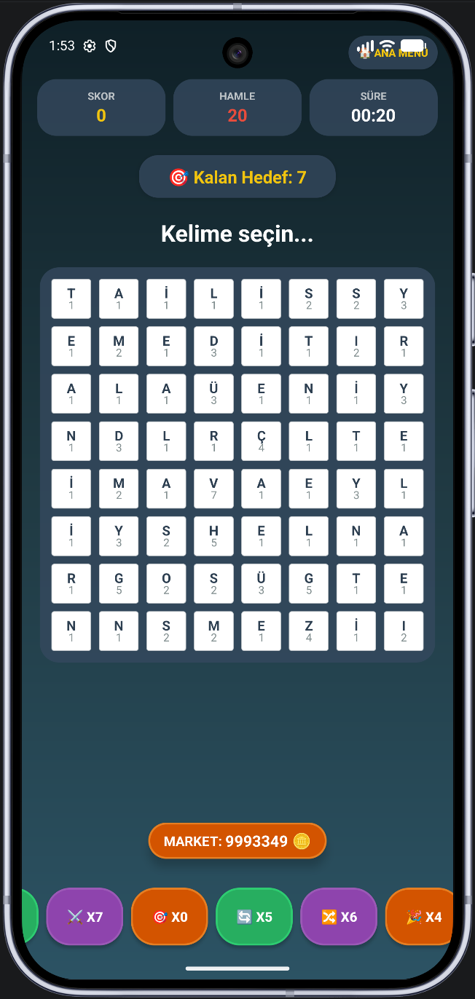

# WordCrush

Türkçe kelime bulmaca oyunu. Oyuncu harf ızgarası üzerinde komşu harfleri sürükleyerek kelime oluşturur; geçerli kelimeler patlar, üstteki harfler yerçekimiyle aşağı düşer ve boşluklar yeniden dolar.

Kocaeli Üniversitesi Bilgisayar Mühendisliği, Yazılım Laboratuvarı II dersi ikinci projesi.

<p align="center">
  
</p>

## Öne çıkan kısımlar

**Tahta rastgele üretilmiyor.** Tamamen rastgele harf dağıtımı çoğu zaman oynanamayan bir ızgara üretir. Bunun yerine önce "tohum kelimeler" DFS ile tahtaya yerleştirilir, kalan hücreler Türkçe harf frekanslarına göre ağırlıklandırılmış rastgele seçimle doldurulur. Frekans tablosu bir `NavigableMap` üzerinde kümülatif ağırlıklarla tutulur; rastgele bir sayı üretilip `higherEntry` ile harf seçilir.

**Sözlük Trie üzerinde.** 62.765 kelimelik Türkçe sözlük önek ağacına yüklenir. Bu sayede hem kelime doğrulaması hem de "bu önekle devam eden kelime var mı" kontrolü sabit zamanda yapılır — ikincisi tahta taramasında budama için kritik.

**Her hamlede oynanabilirlik kontrolü.** `hamleVarMi()` tahtayı DFS ile tarar ve en az bir geçerli kelime kalıp kalmadığını kontrol eder. Kelime kalmadıysa tahta yeniden üretilir.

**Combo.** Bulunan kelimenin içindeki anlamlı alt kelimeler de puanlanır. `ADANA` oynandığında `DANA`, `ANA` ve `ADA` da tespit edilir ve puanları eklenir.

## Oynanış

Izgara boyutu oyun başında seçilir: 6×6 (zor, 15 hamle), 8×8 (orta, 20 hamle), 10×10 (kolay, 25 hamle).

Harfler sekiz yönde komşuluk kuralıyla seçilir; aynı hücre bir kelimede iki kez kullanılamaz. En kısa kelime üç harftir. Parmak kaldırıldığında kelime sözlükte aranır — bulunursa harfler patlar, bulunmazsa seçim iptal edilir. Her iki durumda da bir hamle harcanır.

Her harfin kendi puanı vardır (A: 1, J: 10, Ğ: 8 gibi); kelime puanı harflerin toplamıdır.

### Özel güçler

Uzun kelime oynandığında son harfin bulunduğu hücre özel bir simgeye dönüşür. O hücre sonraki bir kelimede kullanıldığında güç etkinleşir.

| Kelime uzunluğu | Güç | Simge | Etkisi |
|---|---|---|---|
| 4 harf | Satır Temizleme | ↔ | Bulunduğu satırı temizler |
| 5 harf | Alan Patlatma | ✹ | Komşu hücreleri yok eder |
| 6 harf | Sütun Temizleme | ↕ | Bulunduğu sütunu temizler |
| 7+ harf | Mega Patlatma | ✪ | İki birim çevresini yok eder |

### Jokerler

Market ekranından oyun içi altınla satın alınır ve oyun sırasında kullanılır.

| Joker | Altın | Etkisi |
|---|---|---|
| Keskin Nişancı | 75 | Seçilen tek harfi yok eder |
| Balık | 100 | Rastgele harfleri yok eder |
| Serbest Değiştirme | 125 | Komşu iki harfin yerini değiştirir |
| Işın Kılıcı | 200 | Seçilen harfin satır ve sütununu temizler |
| Harf Karıştırma | 300 | Tahtadaki harfleri karıştırır |
| Parti Güçlendiricisi | 400 | Tüm tahtayı yeniler |

Gerçek para ile satın alma yoktur; test kolaylığı için başlangıç bakiyesi yüksek tutulmuştur.

### Skor tablosu

Oynanan her oyun cihazda saklanır. Skor ekranında toplam oyun sayısı, en yüksek ve ortalama puan, toplam bulunan kelime sayısı, en uzun kelime ve toplam süre özetlenir; altında oyun kartları en yeniden eskiye listelenir.

## Gereksinimler

- Android Studio (güncel sürüm — proje AGP 9.1.1 kullanır)
- JDK 11+
- Android SDK 36, minimum API 24 (Android 7.0)

## Kurulum

```bash
git clone https://github.com/Kaanunlu7741/Word-Crush-Mobil.git
cd WordCrushMobil
./gradlew assembleDebug
```

Android Studio ile açıp doğrudan çalıştırmak da mümkündür. Emülatör veya fiziksel cihaz kullanılabilir.

## Proje yapısı

```text
WordCrushMobil/
├── settings.gradle.kts
├── build.gradle.kts
├── gradle/libs.versions.toml
├── docs/
│   └── oyun.png                    ekran görüntüsü
└── app/
    ├── build.gradle.kts
    └── src/main/
        ├── assets/
        │   └── kelimeler.txt       62.765 kelimelik Türkçe sözlük
        ├── java/tr/edu/kocaeli/wordcrush/
        │   ├── MainActivity.kt          kullanıcı adı girişi
        │   ├── MenuActivity.kt          ana menü
        │   ├── SecimEkraniActivity.kt   ızgara boyutu ve hamle seçimi
        │   ├── OyunEkraniActivity.kt    oyun döngüsü ve çizim
        │   ├── MarketActivity.kt        joker satın alma ve simülasyonlar
        │   ├── SkorTablosuActivity.kt   geçmiş oyunlar
        │   ├── HowToPlayActivity.kt     nasıl oynanır
        │   ├── model/
        │   │   ├── Trie.java            önek ağacı, sözlük
        │   │   ├── TrieNode.java        Trie düğüm yapısı
        │   │   ├── Hucre.java           tek hücre: harf, puan, özel güç
        │   │   └── GridManager.java     tahta üretimi, patlama, yerçekimi,
        │   │                            combo, joker etkileri
        │   └── util/
        │       └── SkorManager.kt       skor geçmişi (SharedPreferences + Gson)
        └── res/
            ├── layout/                  ekran düzenleri
            ├── drawable/                arka planlar ve buton stilleri
            └── values/                  renkler, metinler, temalar
```

Oyun mantığı (`model` paketi) Android'e bağımlı değildir; saf Java ile yazılmıştır ve Activity'lerden bağımsız test edilebilir. Arayüz katmanı yalnızca `GridManager`'ın döndürdüğü durumu çizer.

## Teknolojiler

Kotlin, Java, Android SDK, Gson, SharedPreferences, Gradle (Kotlin DSL)

## Notlar

Eğitim amaçlı geliştirilmiştir. `kelimeler.txt` Türkçe sözlük listesi olup oyun içi kelime doğrulaması için kullanılmaktadır.

## Katkı

Bu proje [Talha Yılmaz](https://github.com/TalhaYLMZ11) ile birlikte geliştirilmiştir.
